# Projeto - Cadastro de E-commerce
Na primeira atividade, fui pesquisar 3 sites para pegar varias referencias de varios cadastros. 

Os sites consultados foram:

## Shein

Na Shein os campos identificados foram: 

* Email ou número de celular  
* senha  
* localização  
* número de telefone  
* CPF
* código postal  
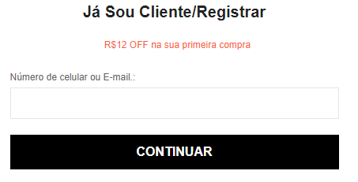
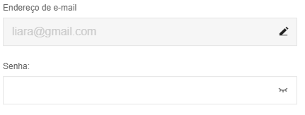
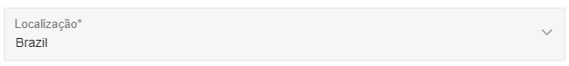
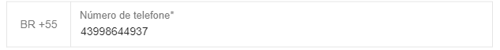
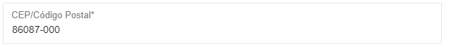

## Casas Bahia

Na Casas Bahia os campos identificados foram:]

* Nome
* Email
* Senha  
* CPF ou CNPJ   
* Celular com add
* Gênero
* Ponto de referência
* Tipo de endereço
* Destinatário  
* Data de nascimento com dia/mês/ano
* CEP  
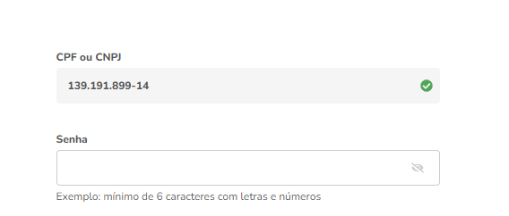
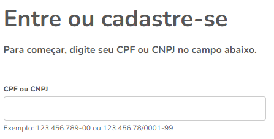
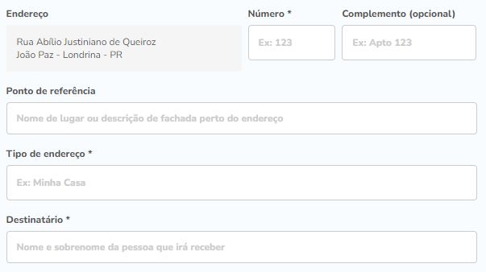
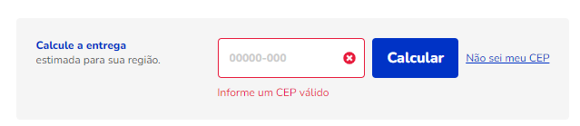

## Ali Express

Na Ali Express os campos identificados foram:

* Sua localização
* E-mail
* Senha  
* Endereço de Entrega
* CPF  
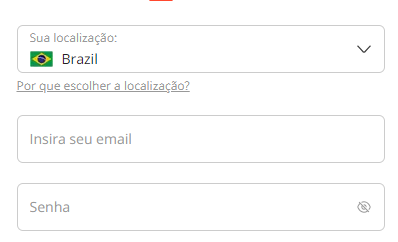
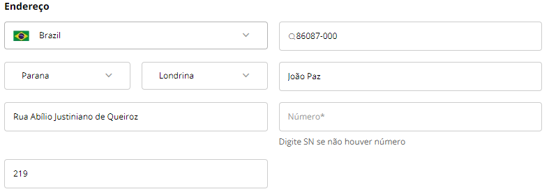
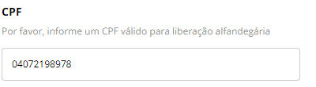

## Formulário de cadastro de E-commerce

No meu formulario para eu planejar ele, tive que pegar 3 referencias de sites para ajudar a planejar o meu e melhorar.

* Nome
* Email
* Senha
* CPF
* Endereço
* bairro
* cidade
* Estado
* CEP  
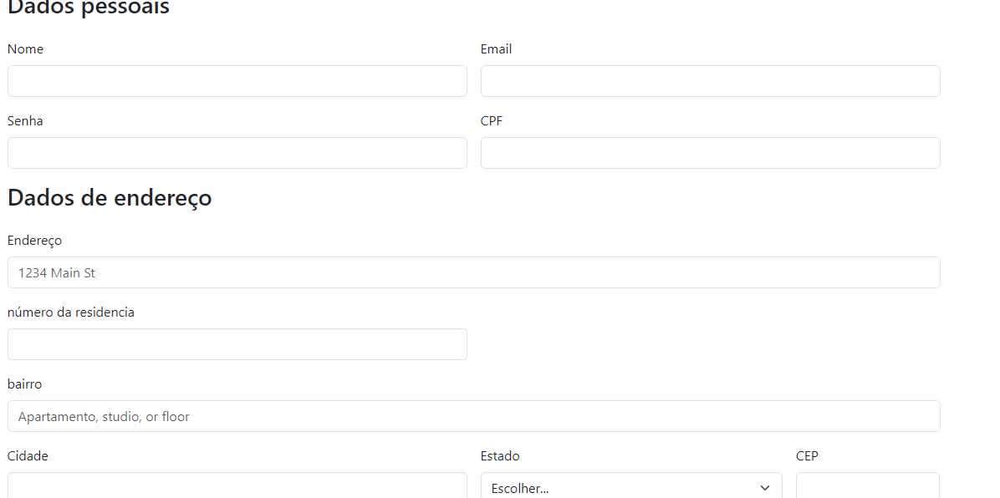